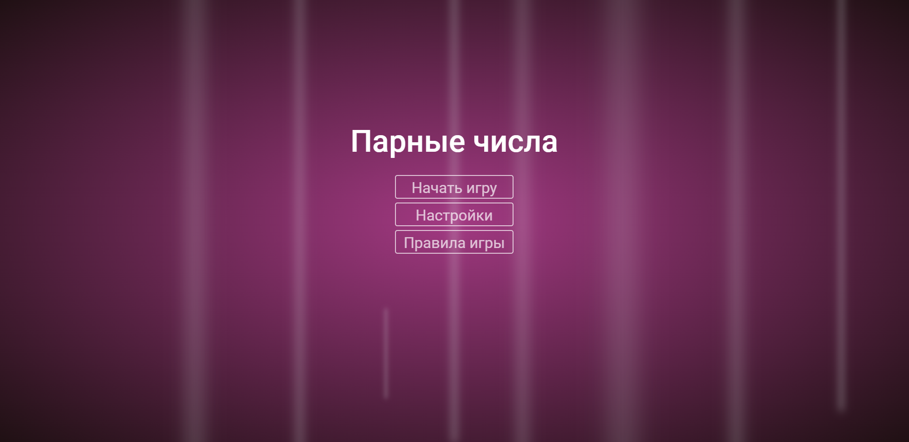
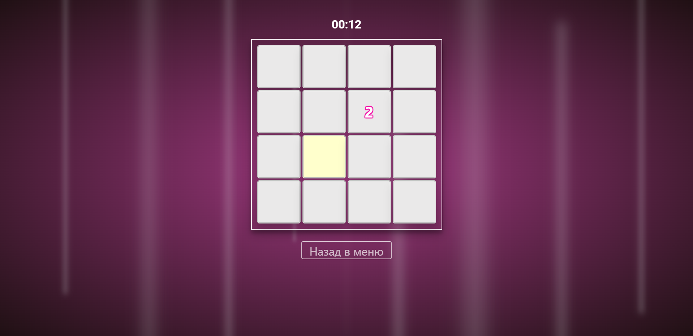
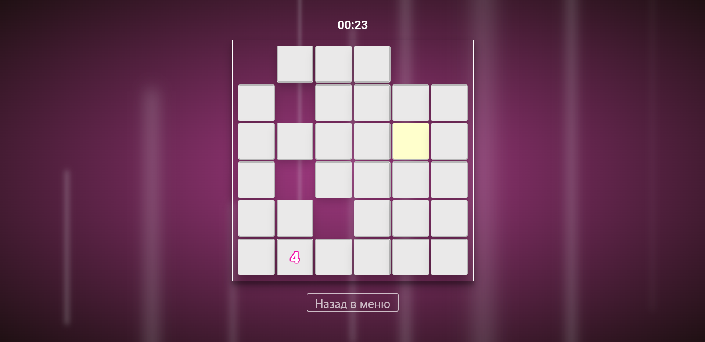

# [RU] Игра Парные числа
Игра-тренажёр для памяти, написанный на ReactJS

Игры с парными числами - тренажер для памяти. Суть игры в том, что за один ход можно открыть две карточки. 
Если цифры на них одинаковые, карточки исчезнут, а если нет, они снова перевернутся. Цель - найти все пары чисел. 
Запоминайте положение цифр, чтобы выиграть!

<a href="https://stormpero.github.io/Paired-numbers-game/" target="_blank">Играть Онлайн</a>
---

# [EN] Paired numbers Game
A memory simulator game written in ReactJS

Games with paired numbers - a simulator for memory. The essence of the game is that you can open two cards in one move. 
If the numbers on them are the same, the cards will disappear, and if not, they will turn over again. The goal is to find all pairs of numbers. 
Memorize the position of the numbers to win!

## Главное меню / Main menu

## Игровой процесс / Gameplay

## Настраиваемый размер поля / Custom field size

